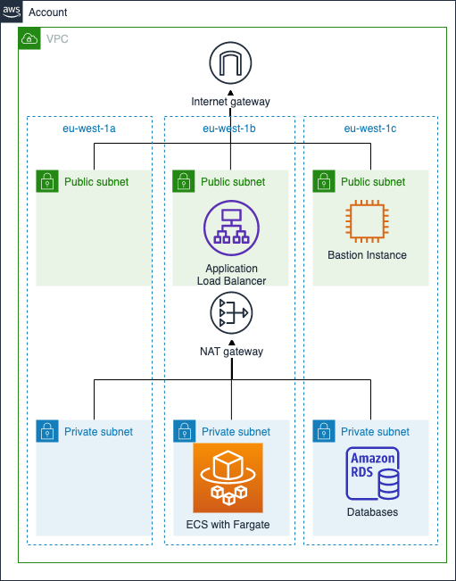

# ecs-demo

This directory contains a demonstration of a Virtual Private Cloud (VPC) created for running applications. For simplicity, only a single web applicationis run, packaged into Docker image and run via the Elatics Container Service (ECS) using the Fargate launch type. Fargate is used to remove the need to provision virtual machines for running Docker containers.

The Fargate runtime is connected to a private subnet (which does not have direct route to public internet). A RDS/PostgreSQL database instance is also attached to the private subnet. Application Load Balancer (ALB) is then deployed to a public subnets, in order to expose the application to the public internet. A bastion host is also deployed to a public subnet, with a publicly accessible IP with a security group with to restrict access for use in on-demand manner. Also, a script for tunneling access to the RDS database through the SSM service (AWS Systems Manager Session Manager, whoa :)) is provided, to even remove the need for a bastion host on the public network (see [Toward a bastion-less world](https://aws.amazon.com/blogs/infrastructure-and-automation/toward-a-bastion-less-world/) for background).

The architecture picture below shows the network structure, along how the services are situated in the subnets.



TODO: diagrams using mermaid or graphviz

TODO: Module dependency graph ()
- ecr
- network
-- ecs
-- rds 
---- bastion


TODO: Painota, että tämä demo on mahdollisimman todenmukainen refe-toteutus, ja sen takia demossa on jonkin verran manuaalisia one-time taskeja. Olisimme voineet myös tehdä demon, jossa yhdellä komennolla saa koko infran aikaan, mutta päädyimme sen sijaan todenmukaisempaan ratkaisuun, jossa on mukana terraform modulien joustavuus ja oikean projektin tietoturva.


TODO: Demo-käsikirjoitus pitää olla todella selkeä ja se pitää harjoitella pari kertaa läpi, ettei tule virheitä eikä väärinkäsityksiä!


# TODO

TODO: Pitää ajaa terraform fmt koko setille lopuksi

TODO: modulien ajojärjestys pitää ohjeistaa

TODO: pitää ohjeistaa, että jos tekee omia uusia moduleita, niin `key` terraform staten pitää olla uniikki:

TODO: voisi laittaa source ../../../tools/terraform-init valittamaan jo TF_VAR_prefix ei asetettu

```hcl-terraform
data "terraform_remote_state" "network" {
  backend   = "s3"
  workspace = terraform.workspace
  config = {
    key    = "ecs-demo-network.tfstate"   # ====> This needs to be unique.
    bucket = var.state_bucket
  }
}
``` 

If you e.g. create a new module `s3`, you have to create a `setup.tf` file and there you need to have a unique `key`, e.g. `"ecs-demo-s3.tfstate"`

```hcl-terraform
    key    = "ecs-demo-s3.tfstate"   # ====> This needs to be unique.
```  
